# AWS Infrastructure Runbook

**Generated:** 2026-04-28T07:12:51.005Z

**Region:** ap-south-1

**Total Resources:** 45

---

## Table of Contents

- [Elastic IPs (2)](#elastic-ips)
- [IAM Policies (3)](#iam-policies)
- [IAM Roles (6)](#iam-roles)
- [Key Pairs (1)](#key-pairs)
- [ACM Certificates (1)](#acm-certificates)
- [EC2 Instances (1)](#ec2-instances)
- [ECR Repositories (2)](#ecr-repositories)
- [EFS File Systems (1)](#efs-file-systems)
- [Security Groups (5)](#security-groups)
- [CloudWatch Log Groups (1)](#cloudwatch-log-groups)
- [Launch Templates (2)](#launch-templates)
- [KMS Keys (1)](#kms-keys)
- [RDS Instances (1)](#rds-instances)
- [Internet Gateways (1)](#internet-gateways)
- [NAT Gateways (1)](#nat-gateways)
- [Route Tables (2)](#route-tables)
- [Subnets (9)](#subnets)
- [VPCs (1)](#vpcs)
- [S3 Buckets (2)](#s3-buckets)
- [VPC Endpoints (1)](#vpc-endpoints)
- [Route 53 Hosted Zones (1)](#route-53-hosted-zones)

---

## Elastic IPs

### project-prod-PRITUNL-EIP

- **Type:** `eip`
- **Identifier:** `eipalloc-0c065673e1ada4a02`
- **Terraform Address:** `aws_eip.vpn-eip`
- **Console:** [Open in AWS Console](https://ap-south-1.console.aws.amazon.com/vpcconsole/home?region=ap-south-1#ElasticIpDetails:AllocationId=eipalloc-0c065673e1ada4a02)

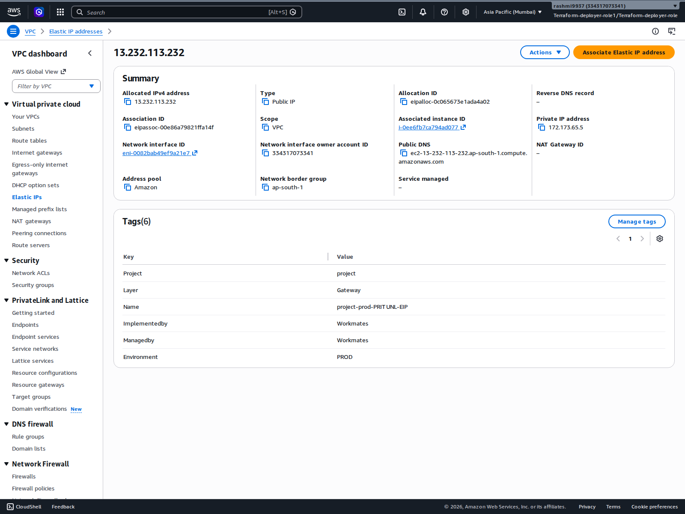

### project-prod-vpc-prod-NAT-EIP

- **Type:** `eip`
- **Identifier:** `eipalloc-0d775764149c4459c`
- **Terraform Address:** `module.vpc.aws_eip.nat[0]`
- **Console:** [Open in AWS Console](https://ap-south-1.console.aws.amazon.com/vpcconsole/home?region=ap-south-1#ElasticIpDetails:AllocationId=eipalloc-0d775764149c4459c)

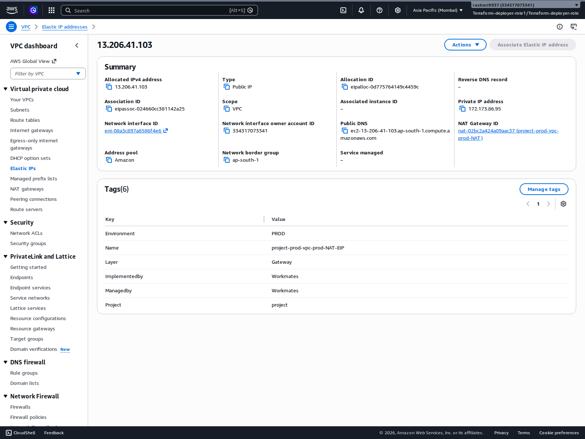

## IAM Policies

### project-prod-ebs-kms

- **Type:** `iam_policy`
- **Identifier:** `arn:aws:iam::334317073341:policy/project-prod-ebs-kms`
- **Terraform Address:** `aws_iam_policy.ebs-kms-policy`
- **Console:** [Open in AWS Console](https://us-east-1.console.aws.amazon.com/iam/home#/policies/details/arn%3Aaws%3Aiam%3A%3A334317073341%3Apolicy%2Fproject-prod-ebs-kms)

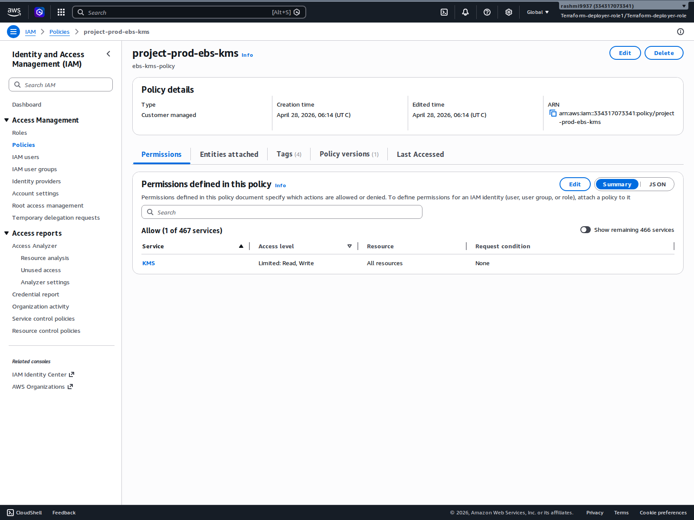

### project-prod-node-kms

- **Type:** `iam_policy`
- **Identifier:** `arn:aws:iam::334317073341:policy/project-prod-node-kms`
- **Terraform Address:** `aws_iam_policy.node-kms-policy`
- **Console:** [Open in AWS Console](https://us-east-1.console.aws.amazon.com/iam/home#/policies/details/arn%3Aaws%3Aiam%3A%3A334317073341%3Apolicy%2Fproject-prod-node-kms)

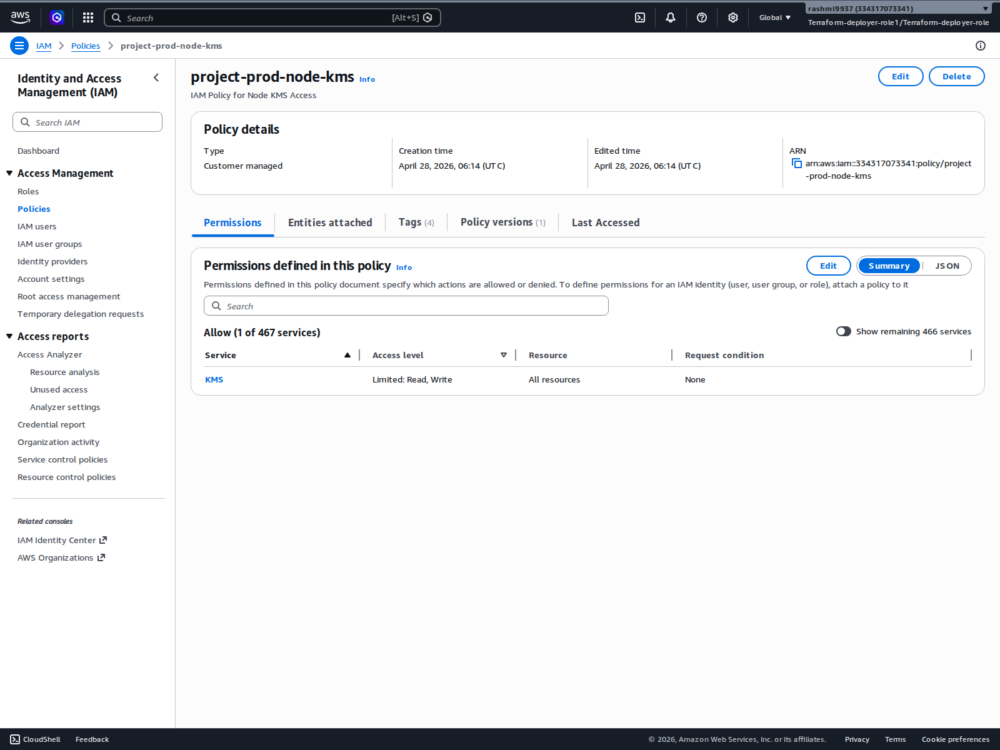

### POC-EKS-ADDITIONAL

- **Type:** `iam_policy`
- **Identifier:** `arn:aws:iam::334317073341:policy/POC-EKS-ADDITIONAL`
- **Terraform Address:** `aws_iam_policy.node_additional`
- **Console:** [Open in AWS Console](https://us-east-1.console.aws.amazon.com/iam/home#/policies/details/arn%3Aaws%3Aiam%3A%3A334317073341%3Apolicy%2FPOC-EKS-ADDITIONAL)

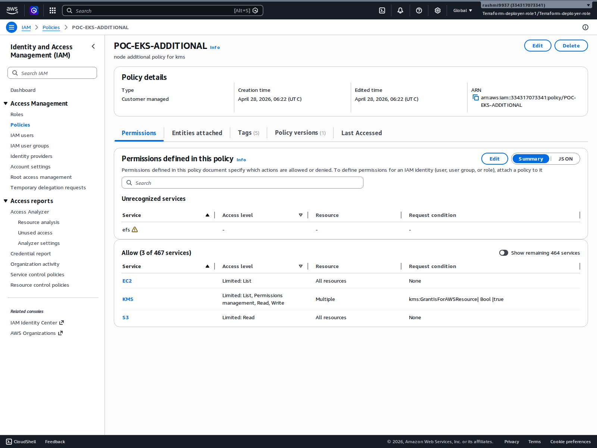

## IAM Roles

### project-prod-ebs-csi-driver

- **Type:** `iam_role`
- **Identifier:** `project-prod-ebs-csi-driver`
- **Terraform Address:** `aws_iam_role.ebs_csi_driver_role`
- **Console:** [Open in AWS Console](https://us-east-1.console.aws.amazon.com/iam/home#/roles/details/project-prod-ebs-csi-driver)

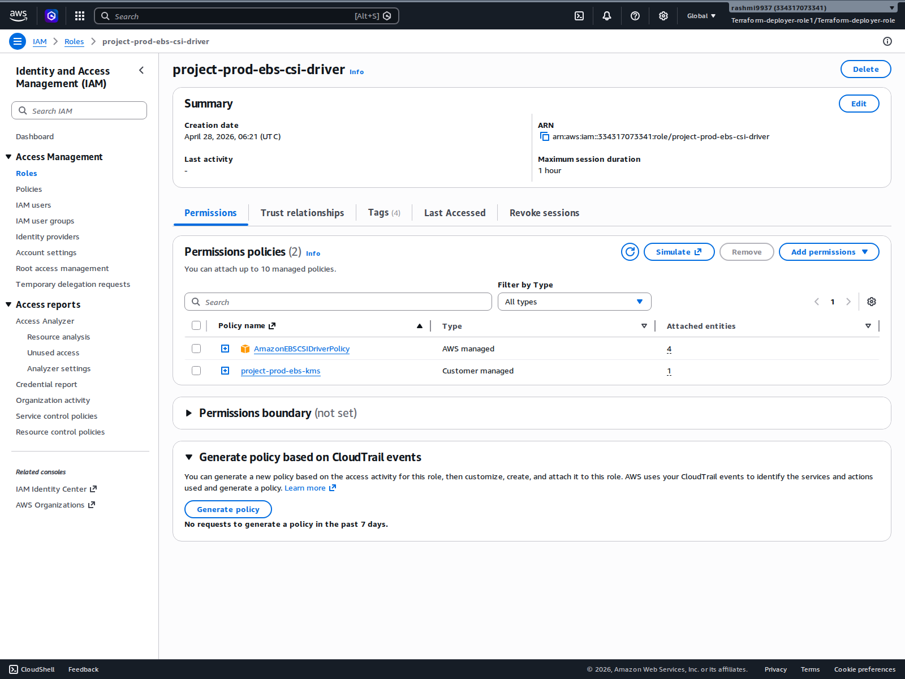

### project-prod-efs-csi-driver

- **Type:** `iam_role`
- **Identifier:** `project-prod-efs-csi-driver`
- **Terraform Address:** `aws_iam_role.efs_csi_driver_role`
- **Console:** [Open in AWS Console](https://us-east-1.console.aws.amazon.com/iam/home#/roles/details/project-prod-efs-csi-driver)

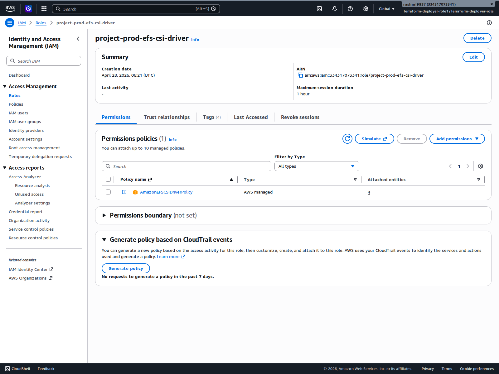

### project-prod-PRITUNL

- **Type:** `iam_role`
- **Identifier:** `project-prod-PRITUNL`
- **Terraform Address:** `module.ec2_pritunl.aws_iam_role.this[0]`
- **Console:** [Open in AWS Console](https://us-east-1.console.aws.amazon.com/iam/home#/roles/details/project-prod-PRITUNL)

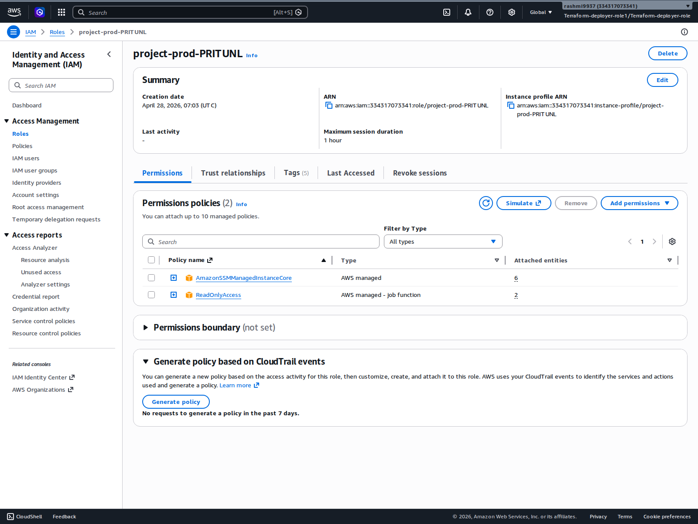

### POC-prod-EKS-CLUSTER-ROLE

- **Type:** `iam_role`
- **Identifier:** `POC-prod-EKS-CLUSTER-ROLE`
- **Terraform Address:** `module.eks_cluster.aws_iam_role.this[0]`
- **Console:** [Open in AWS Console](https://us-east-1.console.aws.amazon.com/iam/home#/roles/details/POC-prod-EKS-CLUSTER-ROLE)

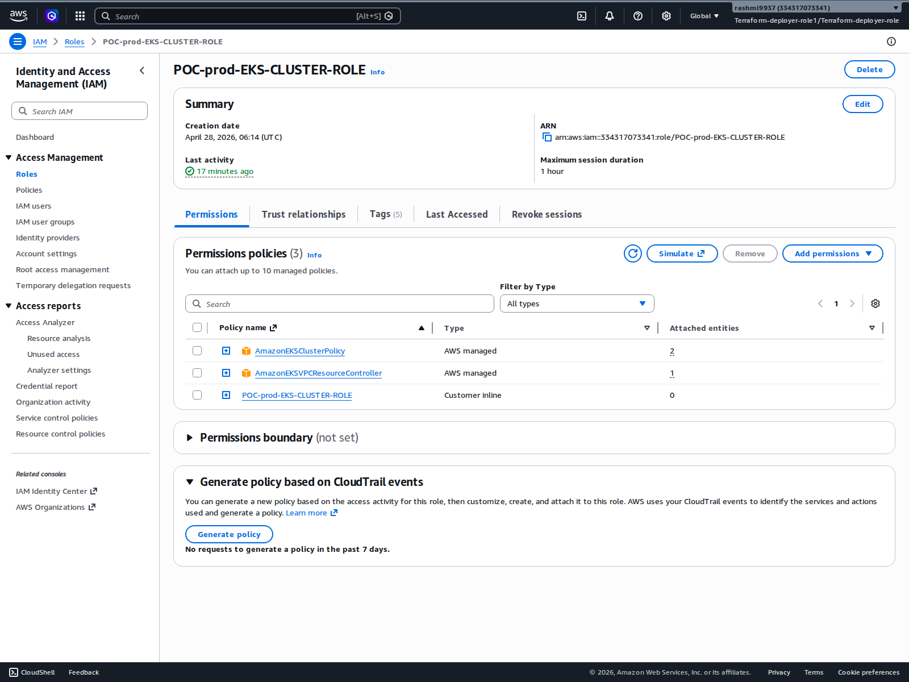

### POC-prod-APPLICATION-NG-ROLE

- **Type:** `iam_role`
- **Identifier:** `POC-prod-APPLICATION-NG-ROLE`
- **Terraform Address:** `module.eks_cluster.module.eks_managed_node_group["APPLICATION-NG"].aws_iam_role.this[0]`
- **Console:** [Open in AWS Console](https://us-east-1.console.aws.amazon.com/iam/home#/roles/details/POC-prod-APPLICATION-NG-ROLE)

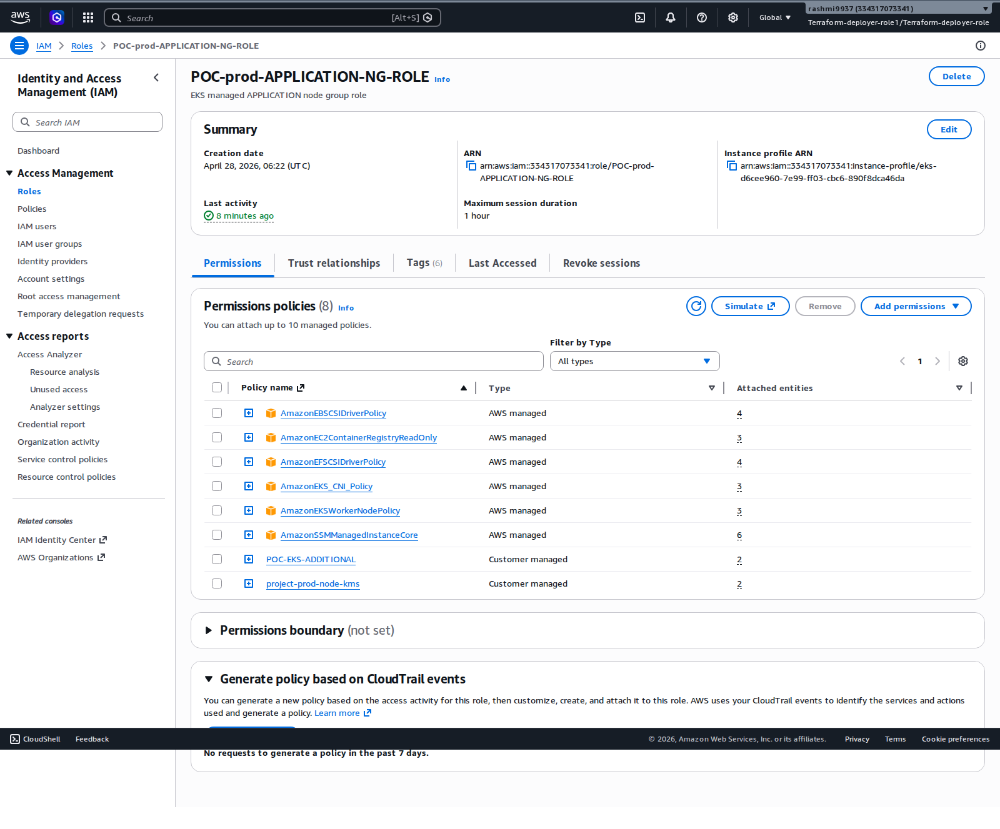

### POC-prod-SERVICE-NG-ROLE

- **Type:** `iam_role`
- **Identifier:** `POC-prod-SERVICE-NG-ROLE`
- **Terraform Address:** `module.eks_cluster.module.eks_managed_node_group["SERVICES-NG"].aws_iam_role.this[0]`
- **Console:** [Open in AWS Console](https://us-east-1.console.aws.amazon.com/iam/home#/roles/details/POC-prod-SERVICE-NG-ROLE)

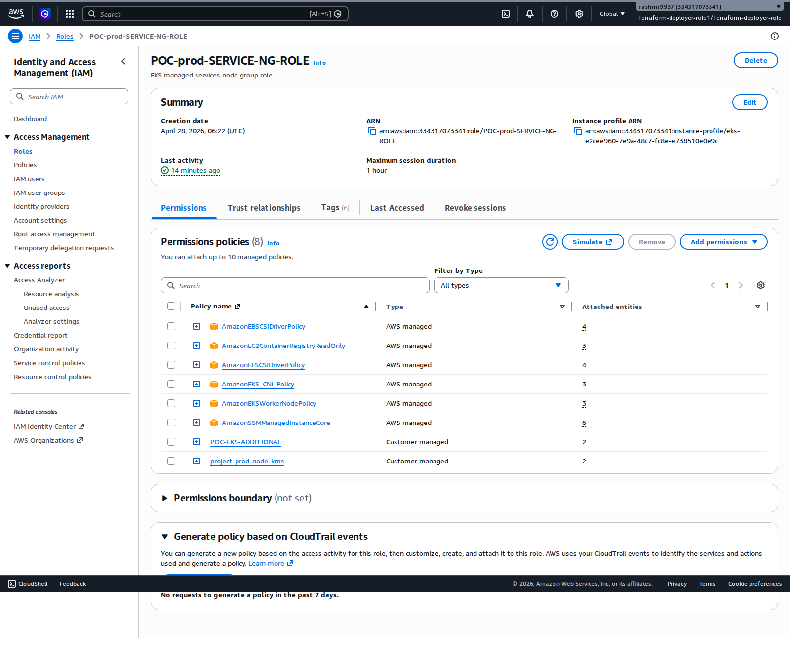

## Key Pairs

### project-Pritunl-VPN-1a-keypair

- **Type:** `key_pair`
- **Identifier:** `project-Pritunl-VPN-1a-keypair`
- **Terraform Address:** `aws_key_pair.vpn_ec2_keypair`
- **Console:** [Open in AWS Console](https://ap-south-1.console.aws.amazon.com/ec2/home?region=ap-south-1#KeyPairs:search=project-Pritunl-VPN-1a-keypair)

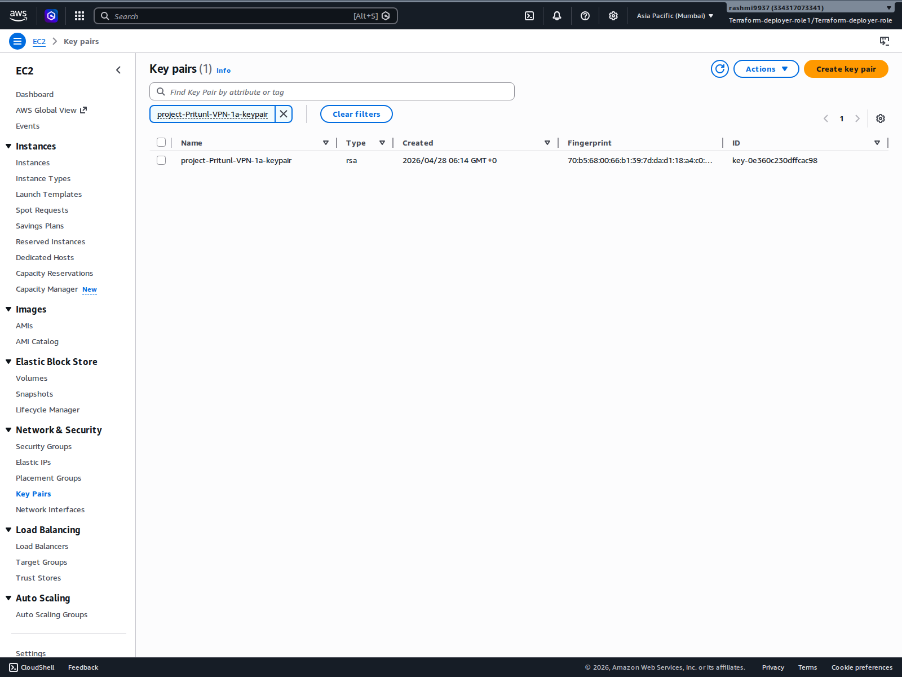

## ACM Certificates

### seawhale.in

- **Type:** `acm`
- **Identifier:** `arn:aws:acm:ap-south-1:334317073341:certificate/ff221b19-cba0-404d-b86d-84d9ff35021c`
- **Terraform Address:** `module.acm_main.aws_acm_certificate.this[0]`
- **Console:** [Open in AWS Console](https://ap-south-1.console.aws.amazon.com/acm/home?region=ap-south-1#/certificates/arn%3Aaws%3Aacm%3Aap-south-1%3A334317073341%3Acertificate%2Fff221b19-cba0-404d-b86d-84d9ff35021c)

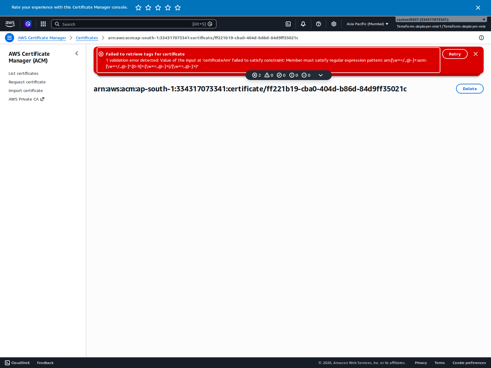

## EC2 Instances

### project-prod-PRITUNL

- **Type:** `ec2`
- **Identifier:** `i-0ee6fb7ca794ad077`
- **Terraform Address:** `module.ec2_pritunl.aws_instance.this[0]`
- **Console:** [Open in AWS Console](https://ap-south-1.console.aws.amazon.com/ec2/home?region=ap-south-1#InstanceDetails:instanceId=i-0ee6fb7ca794ad077)

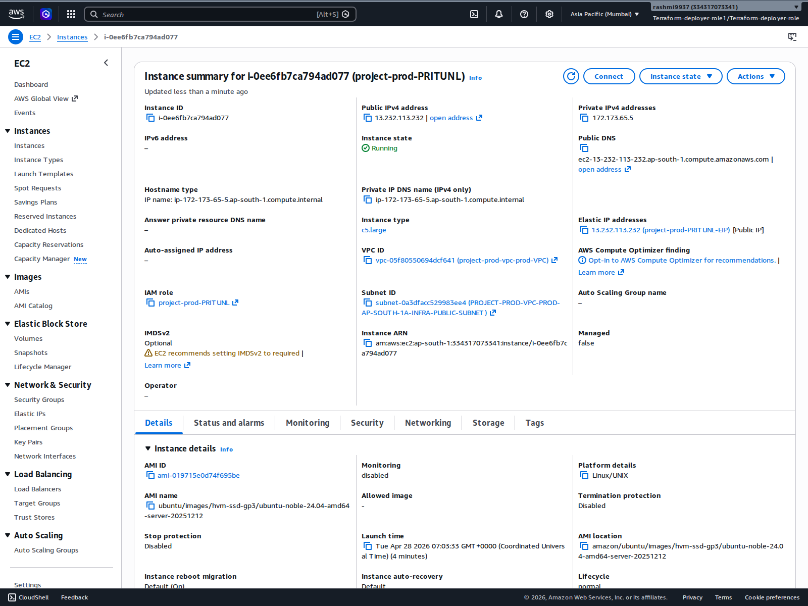

## ECR Repositories

### backend_repo

- **Type:** `ecr`
- **Identifier:** `backend_repo`
- **Terraform Address:** `module.ecr_repositories.aws_ecr_repository.this["backend_repo"]`
- **Console:** [Open in AWS Console](https://ap-south-1.console.aws.amazon.com/ecr/repositories/private/backend_repo?region=ap-south-1)

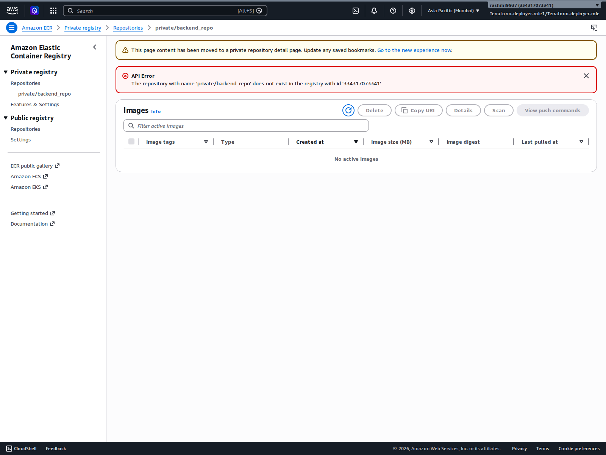

### frontend_repo

- **Type:** `ecr`
- **Identifier:** `frontend_repo`
- **Terraform Address:** `module.ecr_repositories.aws_ecr_repository.this["frontend_repo"]`
- **Console:** [Open in AWS Console](https://ap-south-1.console.aws.amazon.com/ecr/repositories/private/frontend_repo?region=ap-south-1)

## EFS File Systems

### project-prod-efs

- **Type:** `efs`
- **Identifier:** `fs-06aef1159d042a2b3`
- **Terraform Address:** `module.efs.aws_efs_file_system.this[0]`
- **Console:** [Open in AWS Console](https://ap-south-1.console.aws.amazon.com/efs/home?region=ap-south-1#/file-systems/fs-06aef1159d042a2b3)

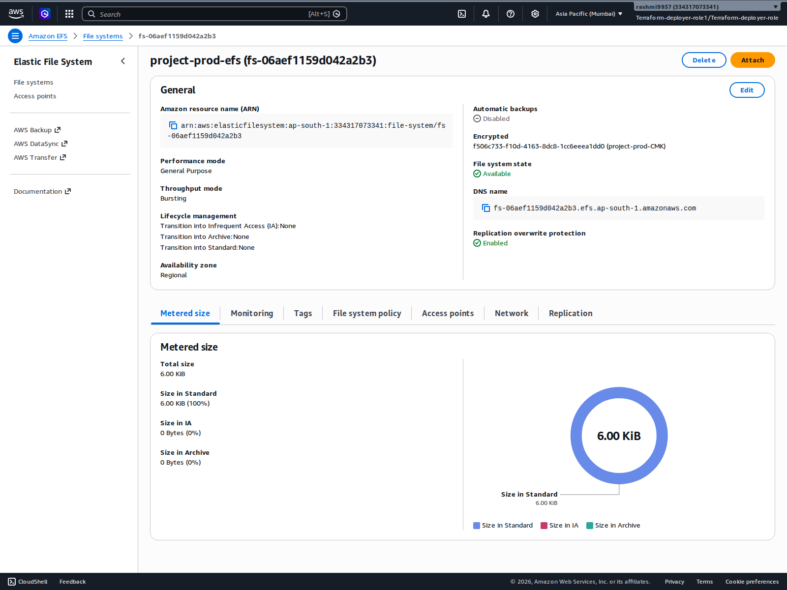

## Security Groups

### Project-Prod-SG

- **Type:** `sg`
- **Identifier:** `sg-0e16430f00bd48e50`
- **Terraform Address:** `module.efs_security_group.aws_security_group.this`
- **Console:** [Open in AWS Console](https://ap-south-1.console.aws.amazon.com/vpcconsole/home?region=ap-south-1#SecurityGroup:groupId=sg-0e16430f00bd48e50)

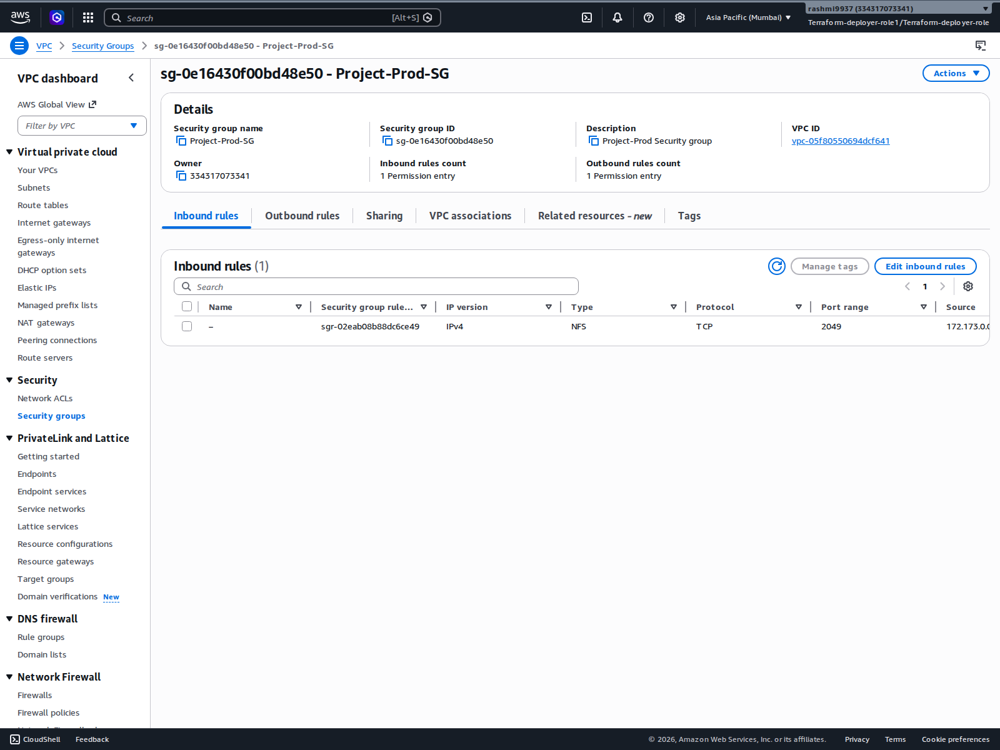

### POC-prod-EKS-CLUSTER-cluster

- **Type:** `sg`
- **Identifier:** `sg-00e59aa3a08295d04`
- **Terraform Address:** `module.eks_cluster.aws_security_group.cluster[0]`
- **Console:** [Open in AWS Console](https://ap-south-1.console.aws.amazon.com/vpcconsole/home?region=ap-south-1#SecurityGroup:groupId=sg-00e59aa3a08295d04)

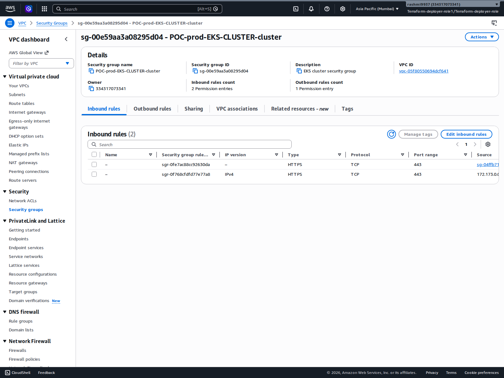

### POC-prod-EKS-CLUSTER-node

- **Type:** `sg`
- **Identifier:** `sg-04ffb714d21373679`
- **Terraform Address:** `module.eks_cluster.aws_security_group.node[0]`
- **Console:** [Open in AWS Console](https://ap-south-1.console.aws.amazon.com/vpcconsole/home?region=ap-south-1#SecurityGroup:groupId=sg-04ffb714d21373679)

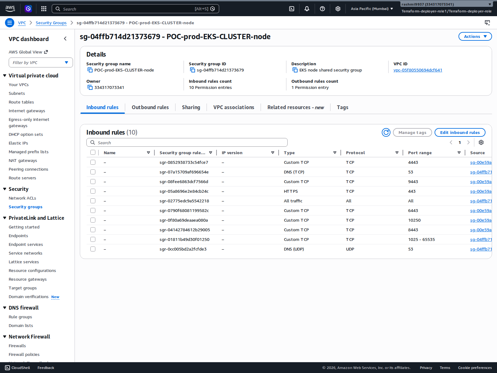

### PROJECT-PROD-PRITUNL-SG

- **Type:** `sg`
- **Identifier:** `sg-0b24118a0ae87d451`
- **Terraform Address:** `module.pritunl-securtiy-group.aws_security_group.this`
- **Console:** [Open in AWS Console](https://ap-south-1.console.aws.amazon.com/vpcconsole/home?region=ap-south-1#SecurityGroup:groupId=sg-0b24118a0ae87d451)

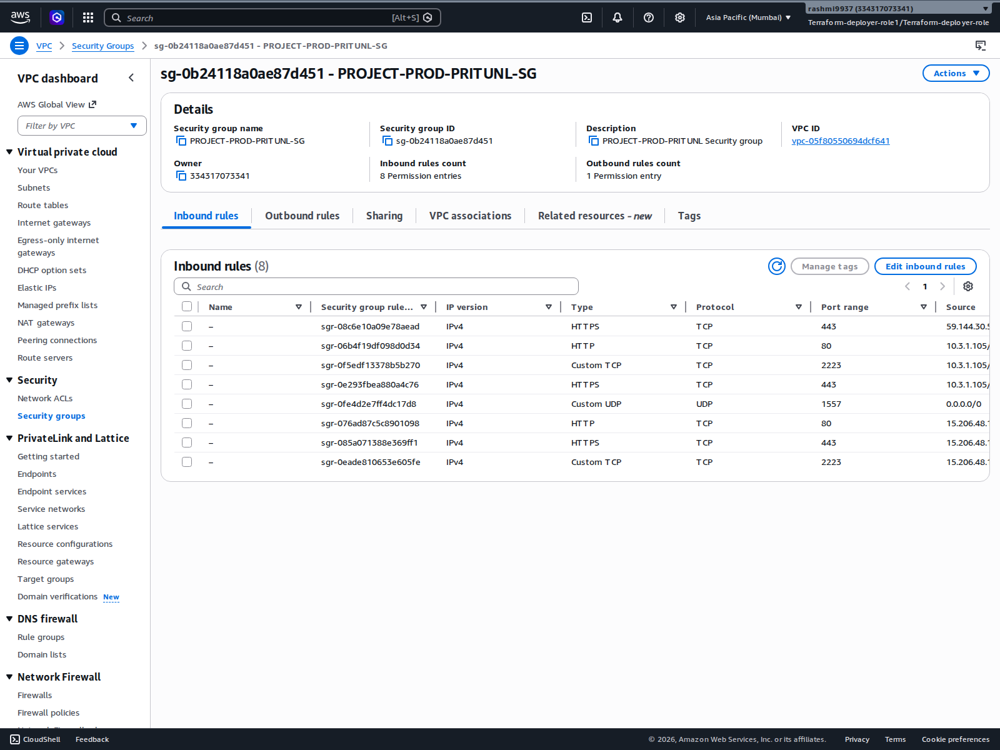

### Project-Prod-Rds-sg

- **Type:** `sg`
- **Identifier:** `sg-099930d098528acb3`
- **Terraform Address:** `module.rds_security_group.aws_security_group.this`
- **Console:** [Open in AWS Console](https://ap-south-1.console.aws.amazon.com/vpcconsole/home?region=ap-south-1#SecurityGroup:groupId=sg-099930d098528acb3)

## CloudWatch Log Groups

### /aws/eks/POC-prod-EKS-CLUSTER/cluster

- **Type:** `cw_log_group`
- **Identifier:** `/aws/eks/POC-prod-EKS-CLUSTER/cluster`
- **Terraform Address:** `module.eks_cluster.aws_cloudwatch_log_group.this[0]`
- **Console:** [Open in AWS Console](https://ap-south-1.console.aws.amazon.com/cloudwatch/home?region=ap-south-1#logsV2:log-groups/log-group/%2Faws%2Feks%2FPOC-prod-EKS-CLUSTER%2Fcluster)

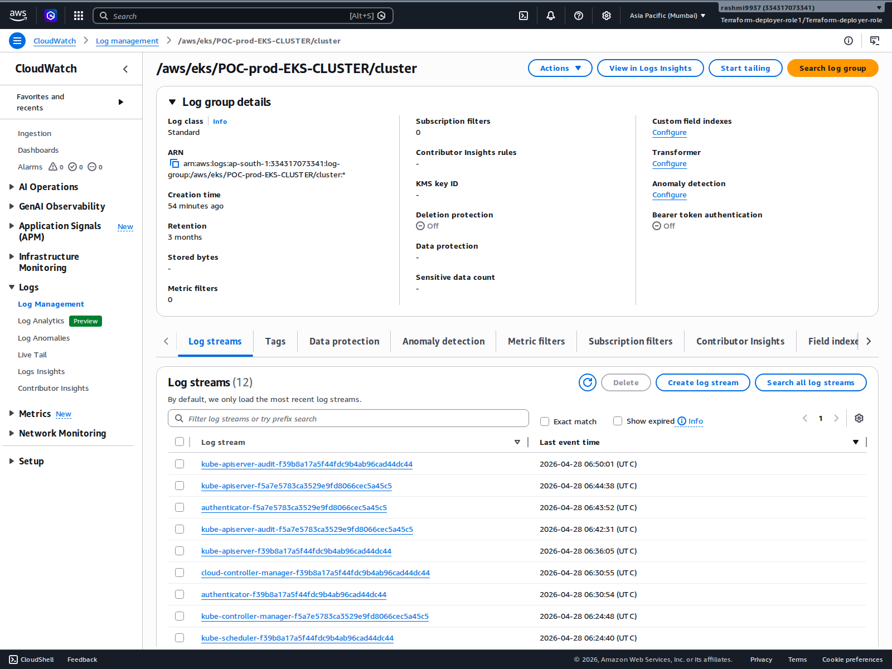

## Launch Templates

### APPLICATION-NG

- **Type:** `launch_template`
- **Identifier:** `lt-074aa64a65972f779`
- **Terraform Address:** `module.eks_cluster.module.eks_managed_node_group["APPLICATION-NG"].aws_launch_template.this[0]`
- **Console:** [Open in AWS Console](https://ap-south-1.console.aws.amazon.com/ec2/home?region=ap-south-1#LaunchTemplates:search=lt-074aa64a65972f779)

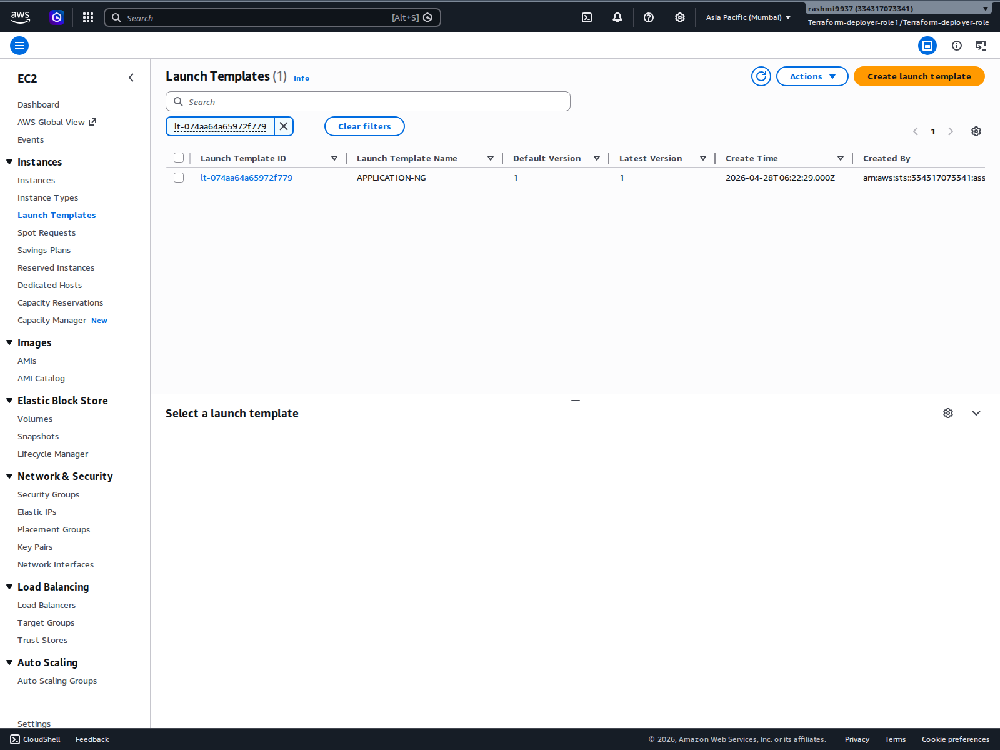

### SERVICES-NG

- **Type:** `launch_template`
- **Identifier:** `lt-0e628087425494a31`
- **Terraform Address:** `module.eks_cluster.module.eks_managed_node_group["SERVICES-NG"].aws_launch_template.this[0]`
- **Console:** [Open in AWS Console](https://ap-south-1.console.aws.amazon.com/ec2/home?region=ap-south-1#LaunchTemplates:search=lt-0e628087425494a31)

## KMS Keys

### project prod Customer managed Key

- **Type:** `kms`
- **Identifier:** `f506c733-f10d-4163-8dc8-1cc6eeea1dd0`
- **Terraform Address:** `module.kms_complete.aws_kms_key.this[0]`
- **Console:** [Open in AWS Console](https://ap-south-1.console.aws.amazon.com/kms/home?region=ap-south-1#/kms/keys/f506c733-f10d-4163-8dc8-1cc6eeea1dd0)

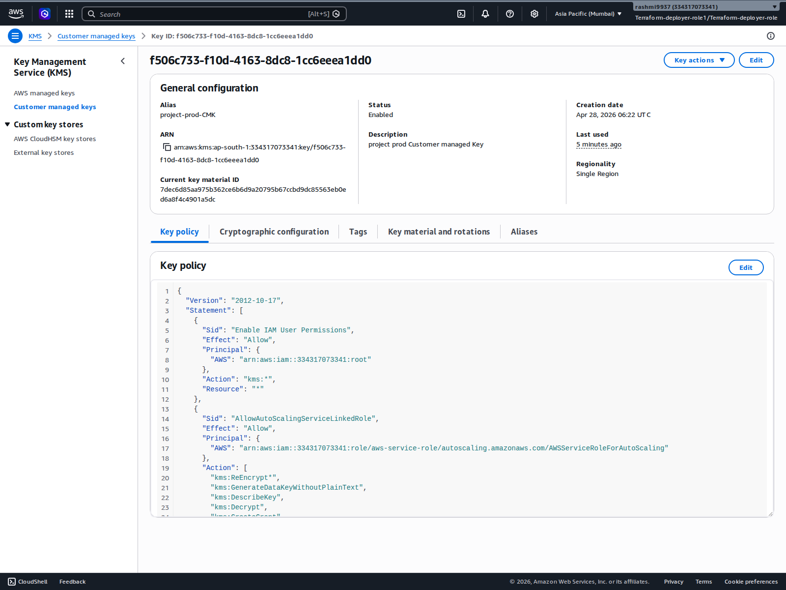

## RDS Instances

### project-prod-rds

- **Type:** `rds`
- **Identifier:** `project-prod-rds`
- **Terraform Address:** `module.rds.module.db_instance.aws_db_instance.this[0]`
- **Console:** [Open in AWS Console](https://ap-south-1.console.aws.amazon.com/rds/home?region=ap-south-1#database:id=project-prod-rds;is-cluster=false)

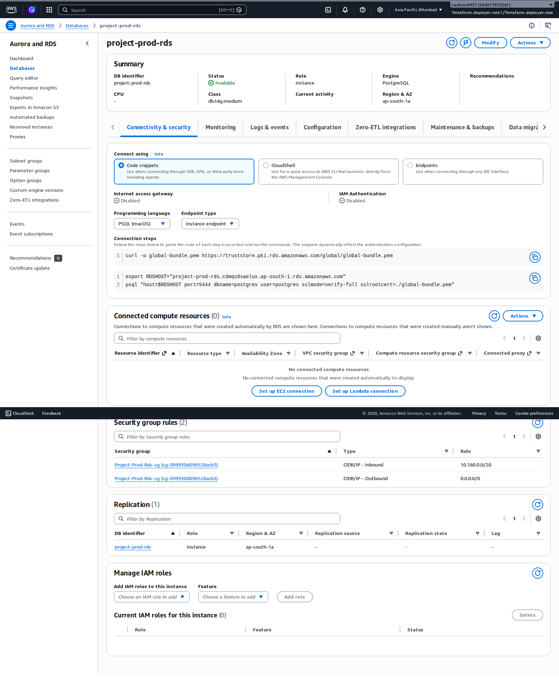

## Internet Gateways

### project-prod-vpc-prod-IG

- **Type:** `igw`
- **Identifier:** `igw-0c0da7d1681e4de30`
- **Terraform Address:** `module.vpc.aws_internet_gateway.this[0]`
- **Console:** [Open in AWS Console](https://ap-south-1.console.aws.amazon.com/vpcconsole/home?region=ap-south-1#InternetGateway:internetGatewayId=igw-0c0da7d1681e4de30)

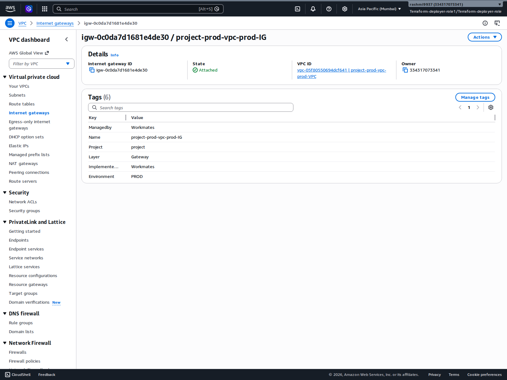

## NAT Gateways

### project-prod-vpc-prod-NAT

- **Type:** `nat_gateway`
- **Identifier:** `nat-02bc2a424a09aac37`
- **Terraform Address:** `module.vpc.aws_nat_gateway.this[0]`
- **Console:** [Open in AWS Console](https://ap-south-1.console.aws.amazon.com/vpcconsole/home?region=ap-south-1#NatGatewayDetails:natGatewayId=nat-02bc2a424a09aac37)

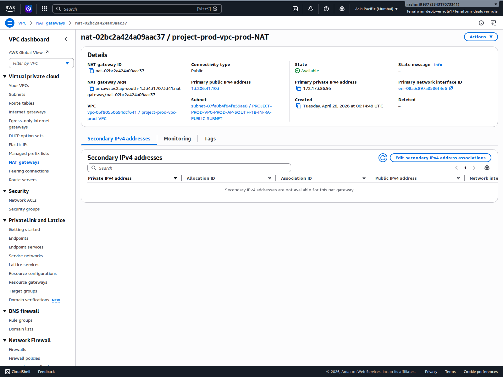

## Route Tables

### project-prod-vpc-prod-PRIVATE-RT

- **Type:** `route_table`
- **Identifier:** `rtb-0b41fe49747d05a30`
- **Terraform Address:** `module.vpc.aws_route_table.private[0]`
- **Console:** [Open in AWS Console](https://ap-south-1.console.aws.amazon.com/vpcconsole/home?region=ap-south-1#RouteTableDetails:RouteTableId=rtb-0b41fe49747d05a30)

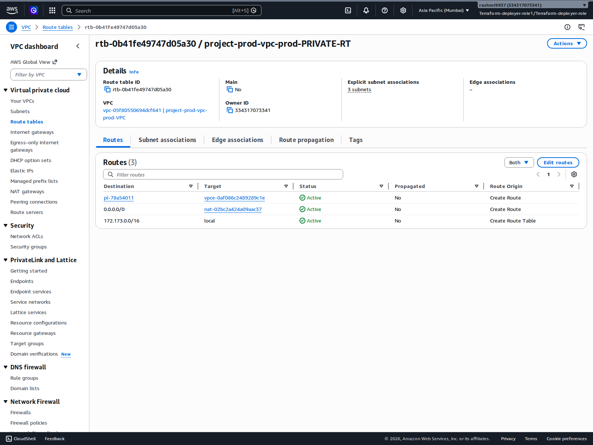

### project-prod-vpc-prod-PUBLIC-RT

- **Type:** `route_table`
- **Identifier:** `rtb-0083cdc72cf0c1de3`
- **Terraform Address:** `module.vpc.aws_route_table.public[0]`
- **Console:** [Open in AWS Console](https://ap-south-1.console.aws.amazon.com/vpcconsole/home?region=ap-south-1#RouteTableDetails:RouteTableId=rtb-0083cdc72cf0c1de3)

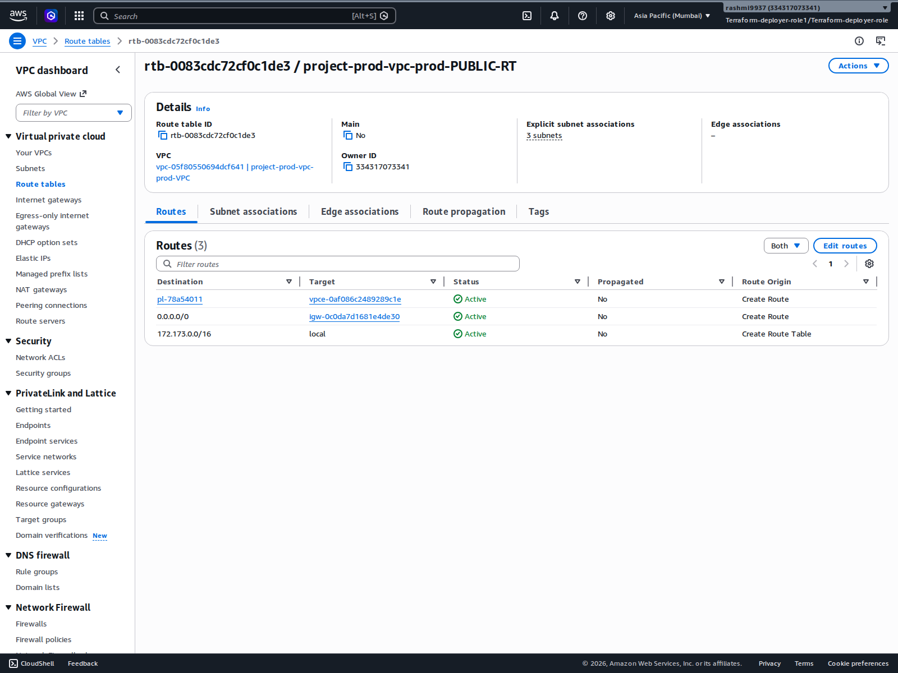

## Subnets

### PROJECT-PROD-VPC-PROD-AP-SOUTH-1A-DB-DB-SUBNET

- **Type:** `subnet`
- **Identifier:** `subnet-07d72d673757f920f`
- **Terraform Address:** `module.vpc.aws_subnet.database[0]`
- **Console:** [Open in AWS Console](https://ap-south-1.console.aws.amazon.com/vpcconsole/home?region=ap-south-1#SubnetDetails:subnetId=subnet-07d72d673757f920f)

### PROJECT-PROD-VPC-PROD-AP-SOUTH-1B-DB-DB-SUBNET

- **Type:** `subnet`
- **Identifier:** `subnet-06063b1927c036694`
- **Terraform Address:** `module.vpc.aws_subnet.database[1]`
- **Console:** [Open in AWS Console](https://ap-south-1.console.aws.amazon.com/vpcconsole/home?region=ap-south-1#SubnetDetails:subnetId=subnet-06063b1927c036694)

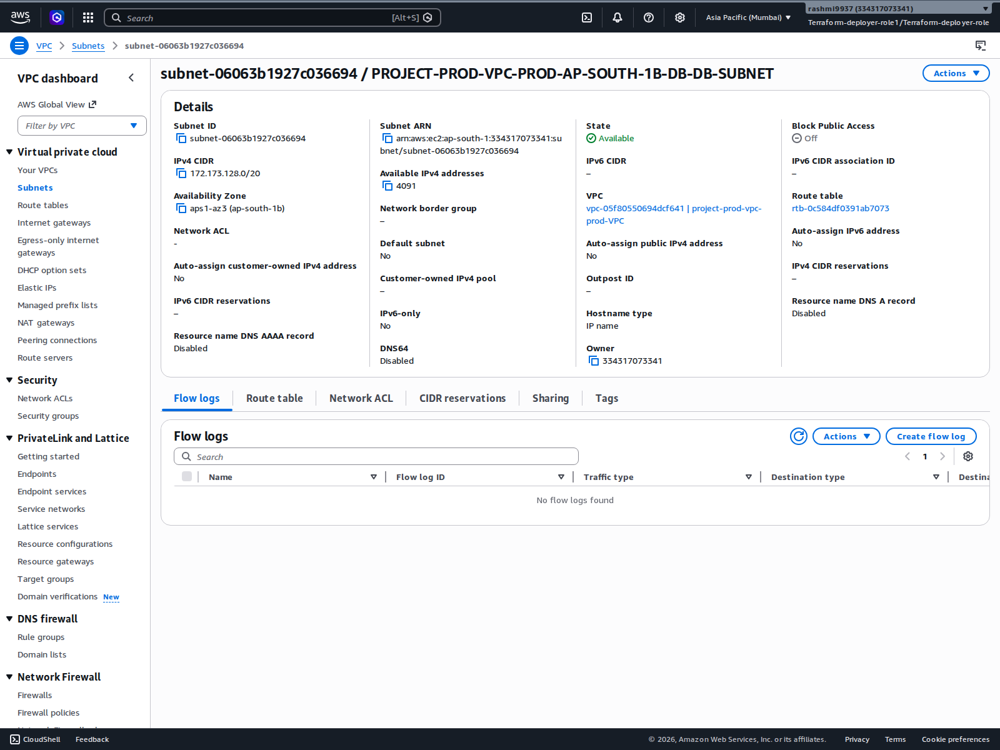

### PROJECT-PROD-VPC-PROD-AP-SOUTH-1C-DB-DB-SUBNET

- **Type:** `subnet`
- **Identifier:** `subnet-0cfdf7a9ee377b8fd`
- **Terraform Address:** `module.vpc.aws_subnet.database[2]`
- **Console:** [Open in AWS Console](https://ap-south-1.console.aws.amazon.com/vpcconsole/home?region=ap-south-1#SubnetDetails:subnetId=subnet-0cfdf7a9ee377b8fd)

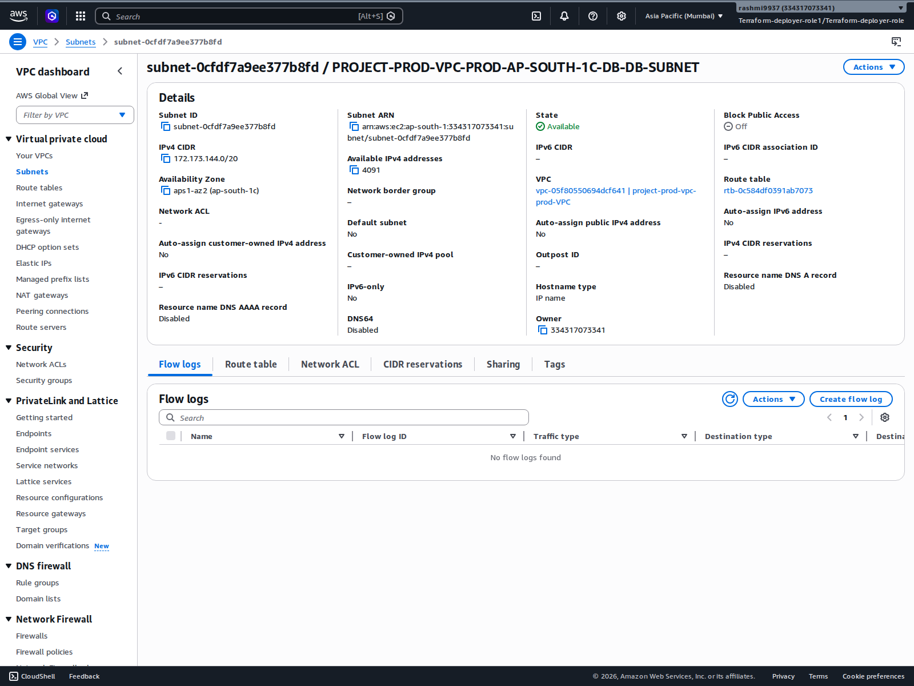

### PROJECT-PROD-VPC-PROD-AP-SOUTH-1A-APP-PRIVATE-SUBNET

- **Type:** `subnet`
- **Identifier:** `subnet-00e3dcda40f41dc63`
- **Terraform Address:** `module.vpc.aws_subnet.private[0]`
- **Console:** [Open in AWS Console](https://ap-south-1.console.aws.amazon.com/vpcconsole/home?region=ap-south-1#SubnetDetails:subnetId=subnet-00e3dcda40f41dc63)

### PROJECT-PROD-VPC-PROD-AP-SOUTH-1B-APP-PRIVATE-SUBNET

- **Type:** `subnet`
- **Identifier:** `subnet-088977166939465a2`
- **Terraform Address:** `module.vpc.aws_subnet.private[1]`
- **Console:** [Open in AWS Console](https://ap-south-1.console.aws.amazon.com/vpcconsole/home?region=ap-south-1#SubnetDetails:subnetId=subnet-088977166939465a2)

### PROJECT-PROD-VPC-PROD-AP-SOUTH-1C-APP-PRIVATE-SUBNET

- **Type:** `subnet`
- **Identifier:** `subnet-09273e29a381cd204`
- **Terraform Address:** `module.vpc.aws_subnet.private[2]`
- **Console:** [Open in AWS Console](https://ap-south-1.console.aws.amazon.com/vpcconsole/home?region=ap-south-1#SubnetDetails:subnetId=subnet-09273e29a381cd204)

### PROJECT-PROD-VPC-PROD-AP-SOUTH-1A-INFRA-PUBLIC-SUBNET

- **Type:** `subnet`
- **Identifier:** `subnet-0a3dfacc529983ee4`
- **Terraform Address:** `module.vpc.aws_subnet.public[0]`
- **Console:** [Open in AWS Console](https://ap-south-1.console.aws.amazon.com/vpcconsole/home?region=ap-south-1#SubnetDetails:subnetId=subnet-0a3dfacc529983ee4)

### PROJECT-PROD-VPC-PROD-AP-SOUTH-1B-INFRA-PUBLIC-SUBNET

- **Type:** `subnet`
- **Identifier:** `subnet-07fa0b4f84fe59ae8`
- **Terraform Address:** `module.vpc.aws_subnet.public[1]`
- **Console:** [Open in AWS Console](https://ap-south-1.console.aws.amazon.com/vpcconsole/home?region=ap-south-1#SubnetDetails:subnetId=subnet-07fa0b4f84fe59ae8)

### PROJECT-PROD-VPC-PROD-AP-SOUTH-1C-INFRA-PUBLIC-SUBNET

- **Type:** `subnet`
- **Identifier:** `subnet-0b8cb86621bfb8968`
- **Terraform Address:** `module.vpc.aws_subnet.public[2]`
- **Console:** [Open in AWS Console](https://ap-south-1.console.aws.amazon.com/vpcconsole/home?region=ap-south-1#SubnetDetails:subnetId=subnet-0b8cb86621bfb8968)

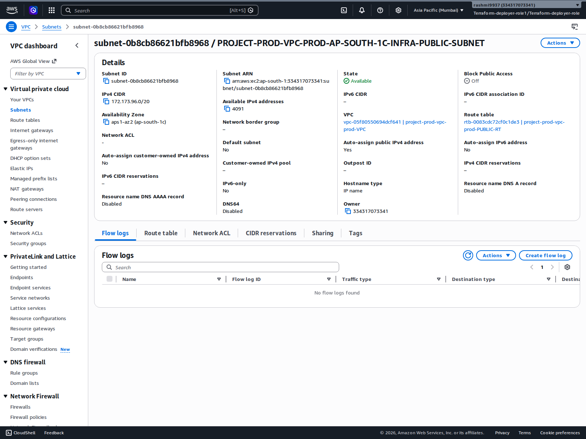

## VPCs

### project-prod-vpc-prod-VPC

- **Type:** `vpc`
- **Identifier:** `vpc-05f80550694dcf641`
- **Terraform Address:** `module.vpc.aws_vpc.this[0]`
- **Console:** [Open in AWS Console](https://ap-south-1.console.aws.amazon.com/vpcconsole/home?region=ap-south-1#VpcDetails:VpcId=vpc-05f80550694dcf641)

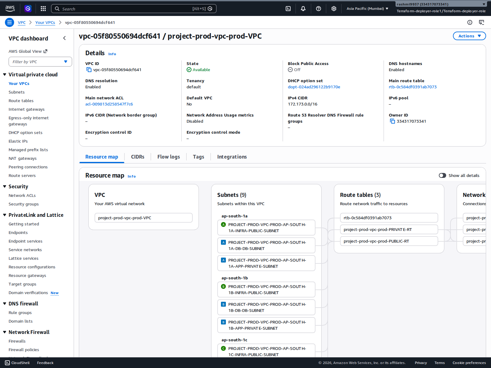

## S3 Buckets

### project-prod-vpcflowlog9937

- **Type:** `s3`
- **Identifier:** `project-prod-vpcflowlog9937`
- **Terraform Address:** `module.vpc-flowlog-bucket.aws_s3_bucket.this[0]`
- **Console:** [Open in AWS Console](https://s3.console.aws.amazon.com/s3/buckets/project-prod-vpcflowlog9937?region=ap-south-1&tab=objects)

### project-prod-pritunl-creds9937

- **Type:** `s3`
- **Identifier:** `project-prod-pritunl-creds9937`
- **Terraform Address:** `module.vpn_credential_bucket.aws_s3_bucket.this[0]`
- **Console:** [Open in AWS Console](https://s3.console.aws.amazon.com/s3/buckets/project-prod-pritunl-creds9937?region=ap-south-1&tab=objects)

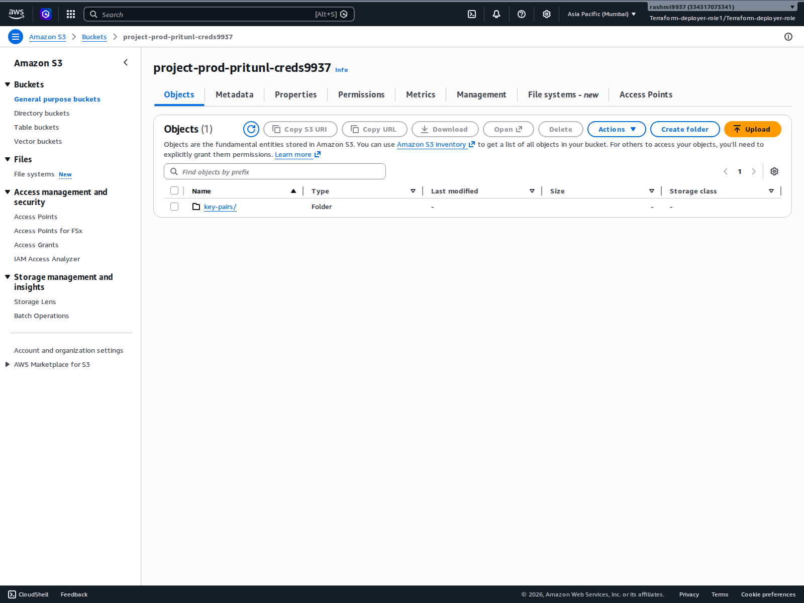

## VPC Endpoints

### project-prod-vpc-prod-S3-Endpoint

- **Type:** `vpc_endpoint`
- **Identifier:** `vpce-0af086c2489289c1e`
- **Terraform Address:** `module.vpc_endpoints.aws_vpc_endpoint.this["s3"]`
- **Console:** [Open in AWS Console](https://ap-south-1.console.aws.amazon.com/vpcconsole/home?region=ap-south-1#EndpointDetails:vpcEndpointId=vpce-0af086c2489289c1e)

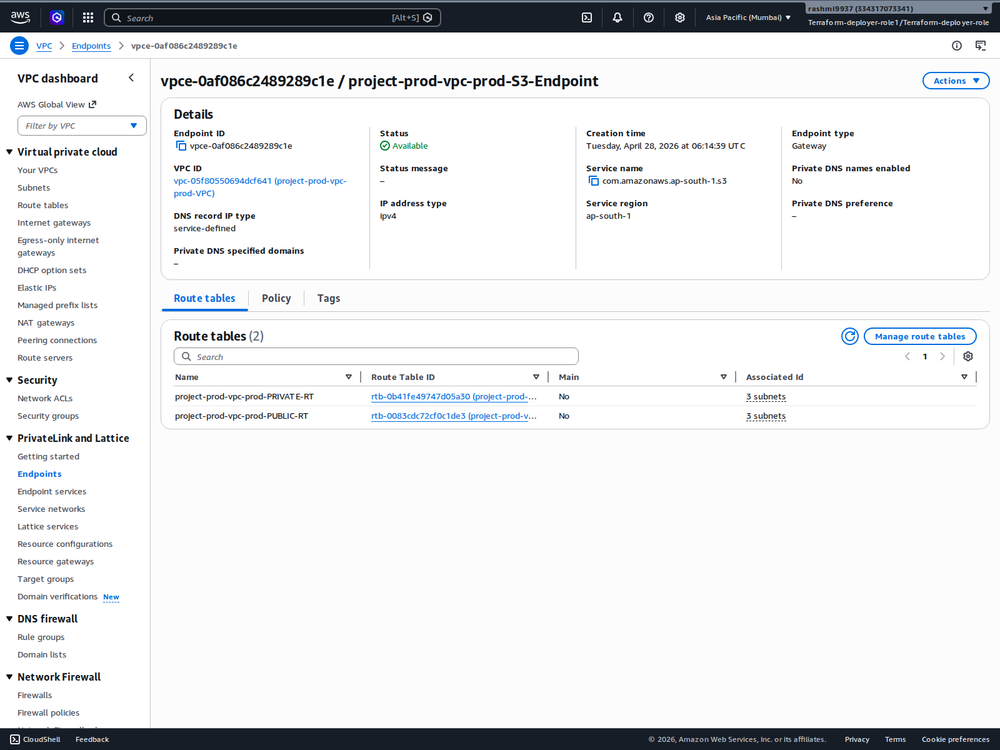

## Route 53 Hosted Zones

### seawhale.in

- **Type:** `route53_zone`
- **Identifier:** `Z015295819VE6D41OJ8PF`
- **Terraform Address:** `module.zones.aws_route53_zone.this["seawhale.in"]`
- **Console:** [Open in AWS Console](https://us-east-1.console.aws.amazon.com/route53/v2/hostedzones#ListRecordSets/Z015295819VE6D41OJ8PF)

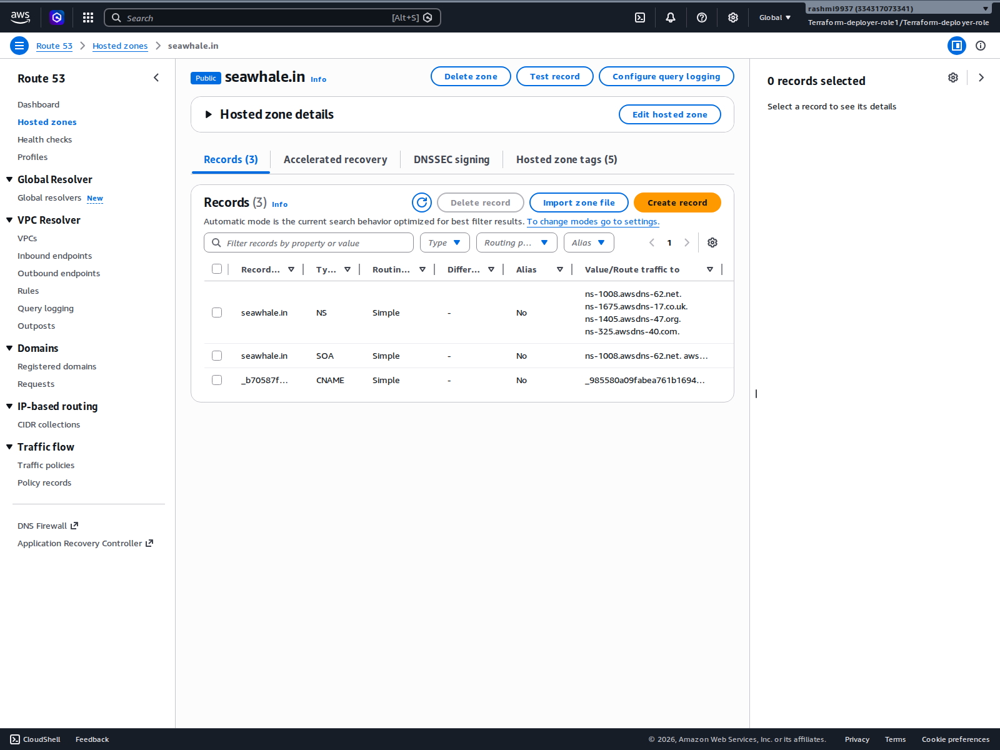
